# JavaScript: Understanding the weird parts

**Syntax parsers**: Evalúa la sintaxis de tu código antes de procesarlo.
Es decir, lee el código y determina si lo ejecuta y si su gramática es
válida.

**Execution context**: Un contenedor para ayudar a administrar el código
que se está ejecutando. Existen muchos lexical environments, el que
maneja cuál de ellos está corriendo ahora es el execution context.
Contiene elementos que no están escritos en tu código.

**Lexical environments**: Relacionado con la gramática, existe en
lenguajes de programación donde importa la ubicación de lo que escribes
en tu código. Donde algo se encuentra físicamente en el código que
escribes, es decir, dónde está escrito y que lo rodea.

**Objeto**: En JavaScript son colecciones de parejas name/value.

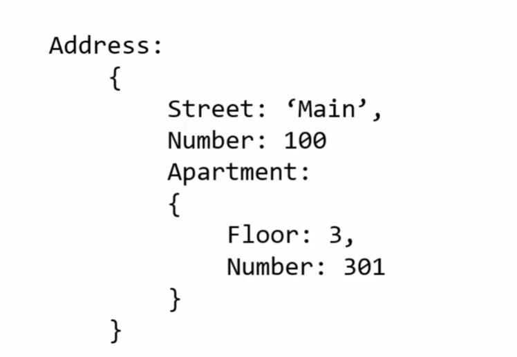

**Global Execution Context GEC**: Es el que corre js y tu código, crea 2
elementos, el objeto global GO el ‘this’

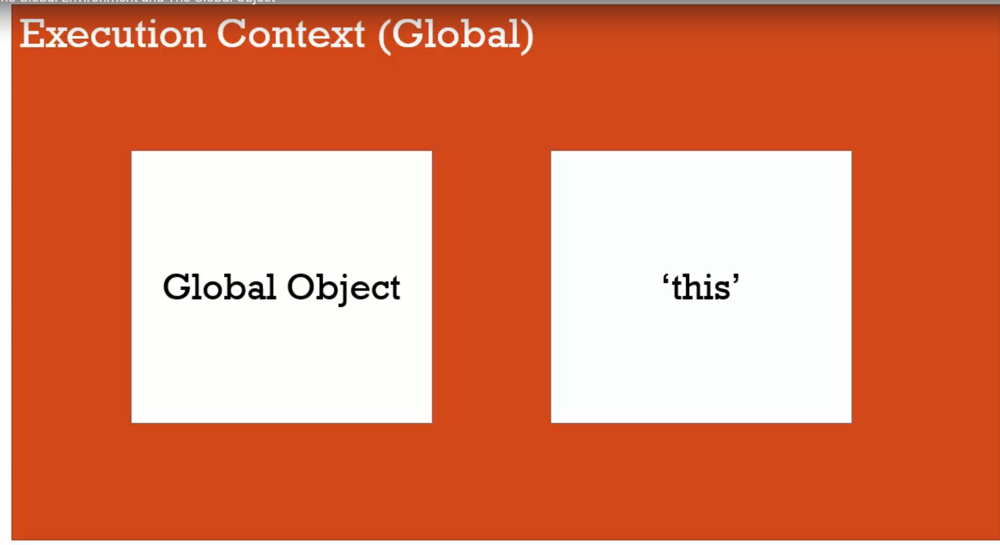

Diferencia entre window y this? El contexto(?)

A nivel global son iguales, al decir global decimos “Cuando no está
dentro de una función”.

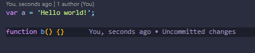

En JS cuando declaramos una variable por fuera de una función, esta
queda embebida al global object/window.

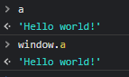

Cuando escribimos código existe el outer environment, que es el enlace a
lo que está fuera de una función.

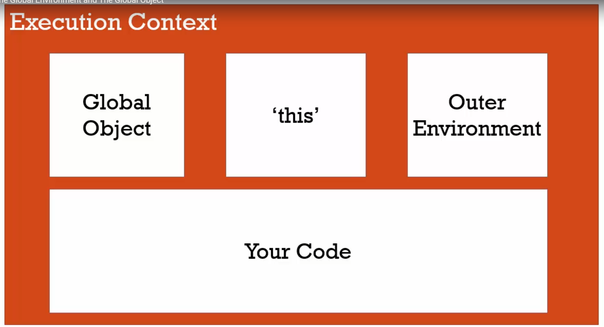

**Execution Context Creation Phase**: GO, 'this', el entorno exterior
está creado. Se crea espacio de memoria para variables (variables y
undefined) y funciones (función completa).

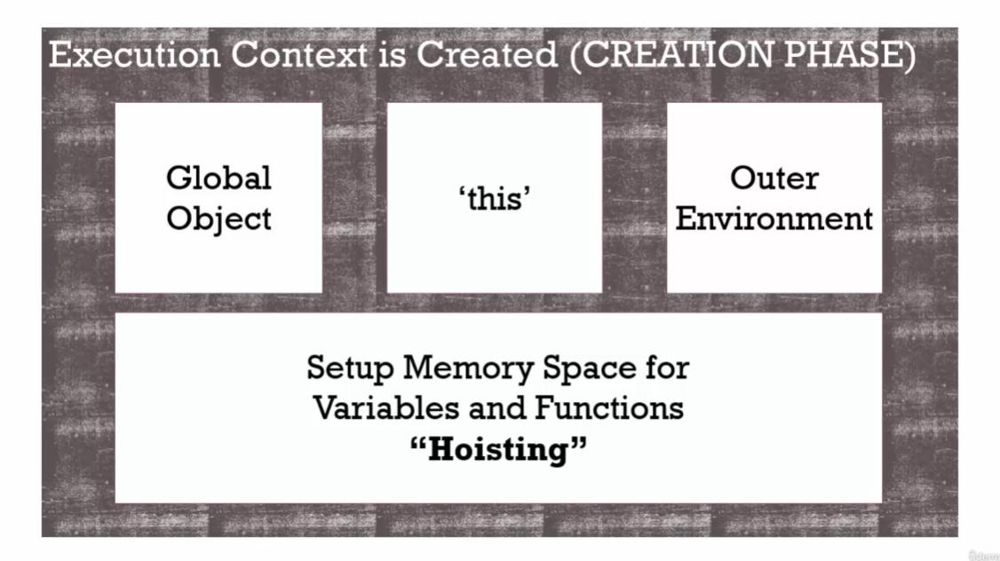

**Hoisting**: Conceptualmente, por ejemplo, una estricta definición de
hoisting sugiere que las declaraciones de variables y funciones son
físicamente movidas al comienzo del código, pero esto no es lo que
ocurre en realidad. Lo que sucede es que las declaraciones de variables
y funciones son asignadas en memoria durante la fase de compilación,
pero quedan exactamente en dónde las has escrito en el código.

Las funciones son almacenadas completamente y las variables son
inicializadas como “undefined”.

[<u>Mas
info</u>](https://developer.mozilla.org/es/docs/Glossary/Hoisting)

**Undefined**: Es un tipo de valor que asigna JavaScript a una variable
para indicar que fue inicializada pero que todavía no posee valor. Es
una palabra reservada.

**Single Threaded**: Un comando se ejecuta a la vez.

**Synchronous**: Uno a la vez, una línea de código se ejecuta una por
una en el orden que están escritas.

**Invocation**: Llamar una función usando paréntesis, ej: miFuncion()

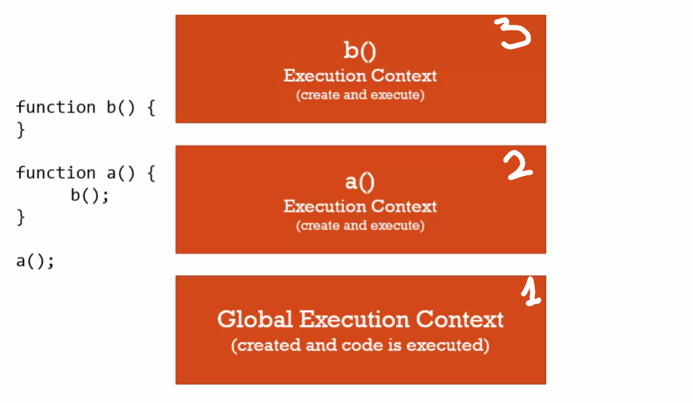

Primero se crea el GEC, luego el EC de a() y finalmente el EC de b(),
después sale b() del stack y luego a()

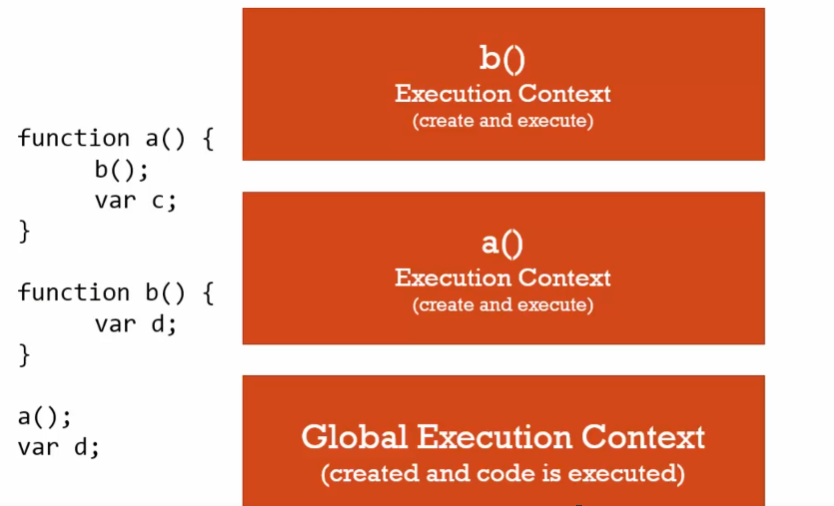

Primero se ejecuta a() y crea su EC, antes de que llegue a var d, ese EC
se pone arriba en de GEC, luego se ejecuta b() y crea otro EC que va
arriba del EC de a(), finalmente cuando se termine la ejecución de b(),
sale del stack, y luego a() ejecuta la siguiente línea de código de EC
que sería var d, después de eso sale del stack dejando solamente el GEC.

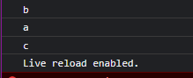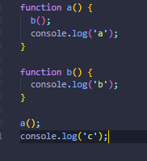

**Variable environment**: Donde están localizadas las variables en
memoria y cómo se relacionan entre ellas.

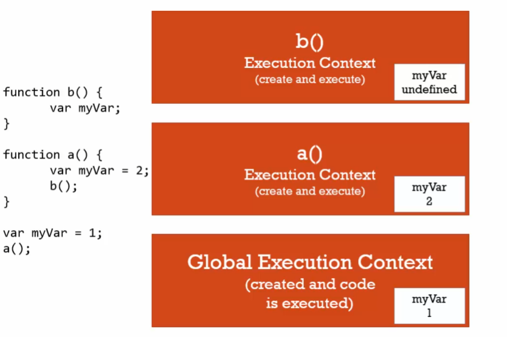

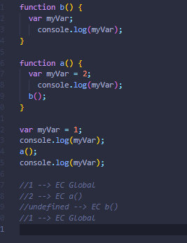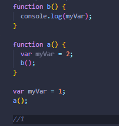

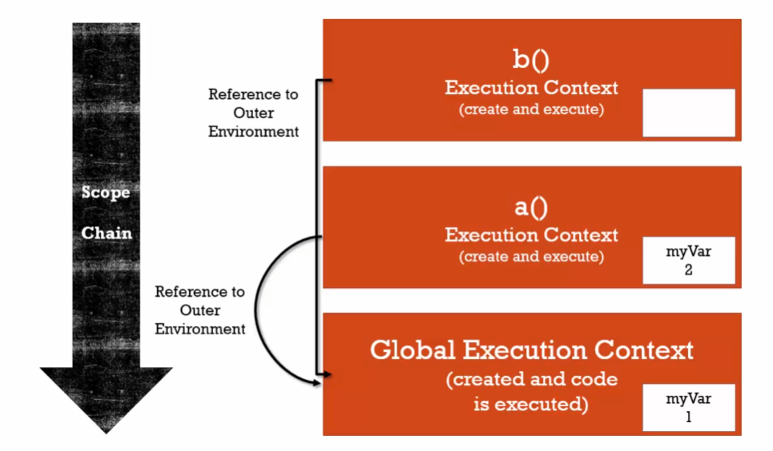

Cada función está enlazada al GEC, en el caso de EC de b() va ata el GEC
para buscar el valor de myVar.

**Outer Environment**: Lo que está fuera del lexical environment de la
ejecución actual.

**Scope**: Donde se aloja una variable dentro del código y si es
realmente la misma variable o una nueva copia. En este caso myBar dentro
de a() y b() nunca van a pisar el valor declarado en el GEC porque están
declaradas dentro de su respectiva función. Scope es donde puedo acceder
a una variable y la cadena son los enlaces a las referencias del Outer
Environment, léxicamente donde se escribió físicamente en su código.

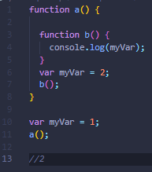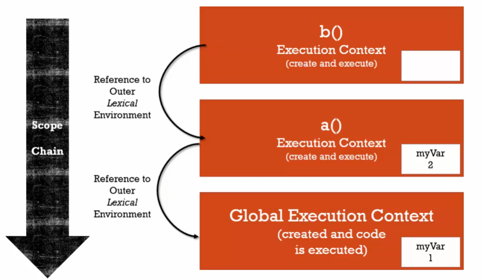

En el ejemplo 1, si cambiamos el LE (Lexical Environment) de b() myVar
va a ser 2 porque léxicamente su ubicación cambió, por ende su enlace al
OE (Outer Environment) va a ser a().

Ahora en el ejemplo 2 b() no puede ser ejecutada en el GEC porque no
existe, solo existe en el LE de a()

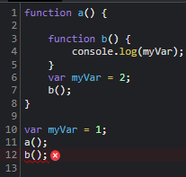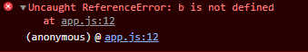

Ahora en el ejemplo 2 b() no puede ser ejecutada en el GEC porque no
existe, solo existe en el LE de a()

**ES6 let**:Permite que JS declare una var, pero no se puede usar hasta
que se defina. También se utiliza para block scoping. Si por ejemplo es
usada dentro de un for loop, let i = 0; i \< cars.length; i++ el valor
de i va a ocupar un espacio distinto en memoria para cada iteración.

**Block scoping**: Una variable para ser usada únicamente dentro de un
bloque de código.

**JavaScript Síncrono**: Cada operación se hace de una vez, bloqueando
el flujo de ejecución, el hilo es bloqueado mientras espera la
respuesta, cuando esta se procesa pasa a la siguiente operación y así
sucesivamente al terminar todas las operaciones.

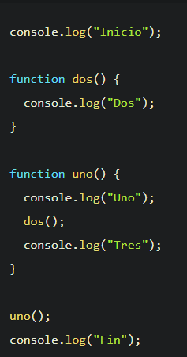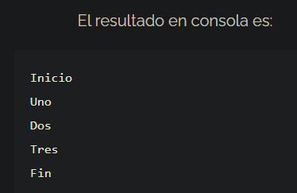

**JavaScript Asíncrono**: Cada operación se ejecuta y devuelve
inmediatamente el control al hilo, evitando el bloqueo, cuando cada
operación termine se enviará una notificación de que ha terminado, es
entonces cuando la respuesta se encolará para ser procesada.

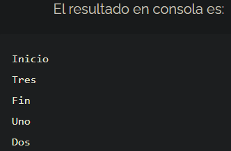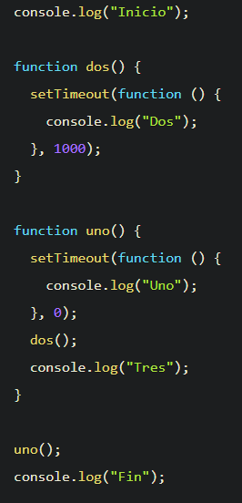

[<u>Más Info</u>](https://jonmircha.com/javascript-asincrono)

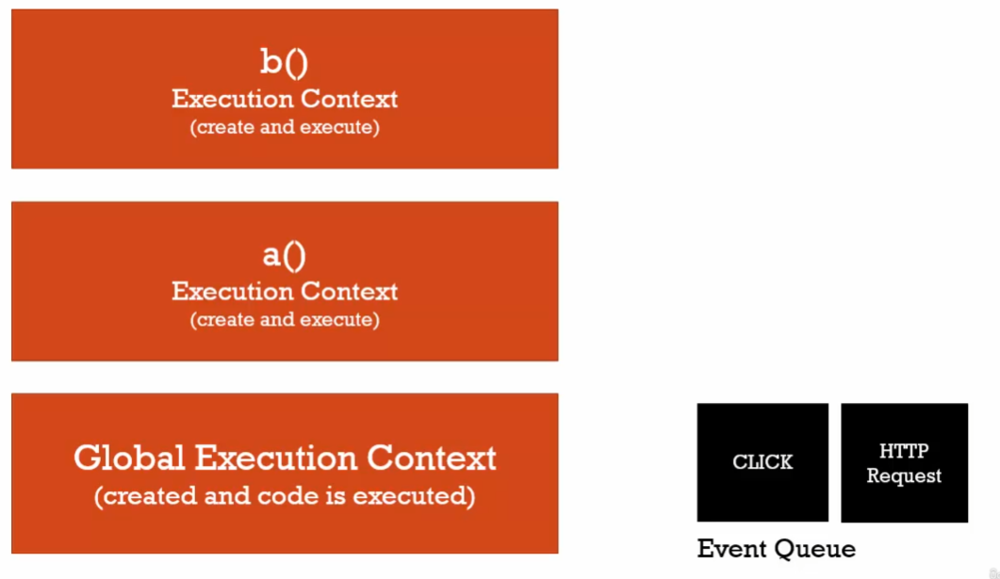

Se arma el stack de contextos de ejecución y se va vaciando en orden,
mientras que paralelamente se crea una cola de eventos.

En el momento en que este stack se vacía, (se ejecutó el EC de b(),
luego el de a() y luego lo que sea que esté en el GEC, siguiendo el
orden del stack o pila) JavaScript escucha los eventos en la cola de
eventos y por cada uno crea un EC de ser necesario, es decir, si hay un
evento click que este dispara una función, se crearía un EC para este
evento.

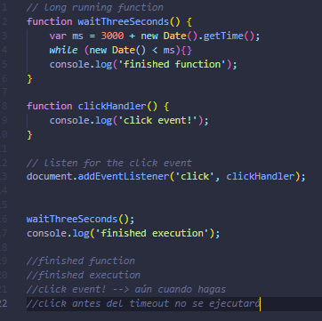

**Dynamic Typing**: no se le dice al motor de JS qué tipo de dato tiene
una variable, él lo descifra a medida que lo va leyendo en el código.
Las variables pueden almacenar distintos tipos de datos que son
entendidos o descifrados durante la ejecución.

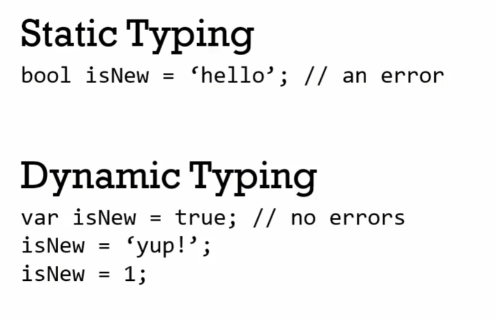

**Primitive Type**: un tipo de dato que representa un único valor. Algo
que no es un objeto.

1.  **Undefined**: representa un dato que aún no existe. Nunca debes
    declarar una variable con este tipo de dato.

2.  **Null**: representa también algo que no existe, literalmente
    significa ‘nada’ y puedes declarar una variable como null.

3.  Boolean: true o false.

4.  **Number**: número o floating point number. A diferencia de otros
    lenguajes, en JS solo existe un tipo de ‘number’.

5.  **String**: una cadena de caracteres donde ‘’ y “” pueden usarse.

6.  **Symbol**: Se usa en ES6. Según MDN es un tipo de datos cuyos
    valores son únicos e immutables. Dichos valores pueden ser
    utilizados como identificadores (claves) de las propiedades de los
    objetos. Cada valor del tipo Symbol tiene asociado un valor del tipo
    String o Undefined que sirve únicamente como descripción del
    símbolo.

**Operator**: Una función especial que es sintácticamente diferente;
generalmente toma dos parámetros y devuelve un resultado.

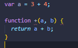

Para el syntax parser de JavaScript el signo “+” es como tener una
función llamada “+” que devuelve la suma de los 2 parámetros. Infix
notation.

“***Los operators son funciones***”

**Operator precedence**: Que función operator es llamada primero. Las
funciones son llamadas por orden de precedencia, mayor precedencia o
prioridad gana.

**Associativity**: Es el orden en que un operator es llamado, de
izquierda a derecha o de derecha a izquierda cuando tienen la misma
precedencia en una función o en una línea de código.

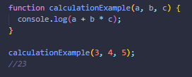

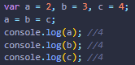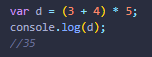

La precedencia es de izquierda a derecha pero matemáticamente la
operación de multiplicación tiene precedencia ante la suma y esto JS lo
sabe. En la siguiente tabla tabla tenemos varios ejemplos, recuerda el
mayor número de precedencia indica cual función u operator será llamado
primero. En el último ejemplo tiene precedencia el paréntesis, tal y
como lo indica la tabla.

**Javascript Operator Precedence --\>** Operator Precedence ‐ Javascript
by Mozilla Contributors is licensed under CC‐BY‐SA 2.5.

**Coercion**: Convertir un tipo de valor a otro. Esto pasa en JS porque
es de tipado dinámico.

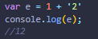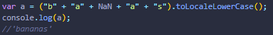

Lo que sucede es que al tener un número y un string los concatena y
devuelve un string porque no puede sumar ambos tipos de datos.

**Comparison Operators --\>** Equality comparisons and sameness by
Mozilla Contributors is licensed under CC‐BY‐SA 2.5.

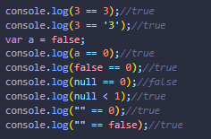

La doble igualdad coerciona los tipos de dato para hacer la comparación

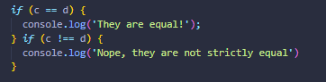

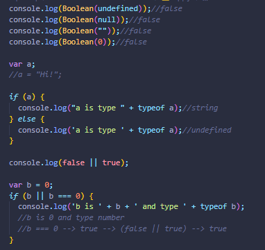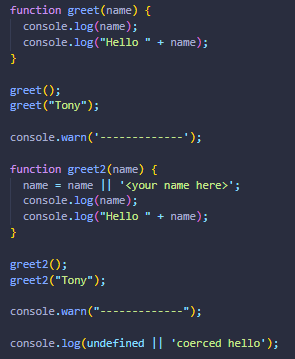

La coerción puede ser útil a la hora de setear valores por defecto, tal
y como se demuestra en el segundo ejemplo. Si no existe el parámetro
name entonces este tendrá un string por defecto. En el caso de que
tengamos undefined \|\| ‘string’ el retorno será ‘string’ porque por
coerción tendríamos una evaluación false \|\| true, donde true será el
valor de ‘string’.

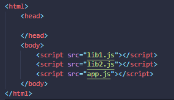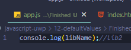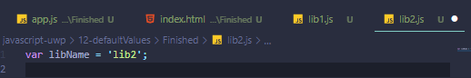

El tener varios archivos JS importados no crea EC para cada archivo.

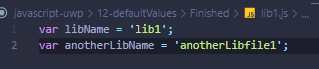

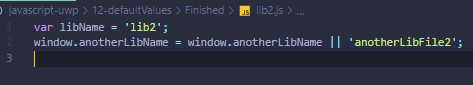

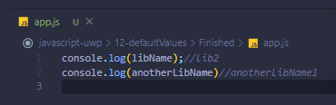

Cada variable queda vinculada al GO (window) por ende podemos fijarnos
si ya tiene un valor y si este no es el caso podemos asignarle un valor
default aprovechandonos de la coerción.

Estructura de un objeto en JS

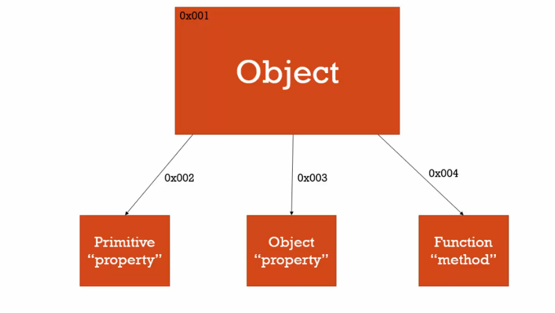

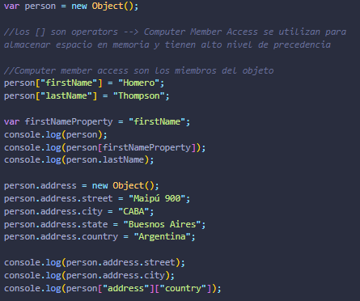

**Namespace**: Un contenedor de variables y funciones, normalmente para
mantener las var y las funciones con el mismo nombre por separado, no en
JS; los objetos se encargan de eso.

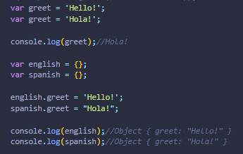

Podemos imitar un namespace creando objetos contenedores para que las
variables no se pisen.

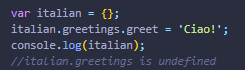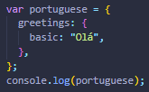

En este ejemplo obtenemos un error porque no podemos crear propiedades
al vuelo, es decir, asumiendo que ya existe el contenedor para italian
pero que este no tiene la propiedad greetings y que a su vez esta
contenga una propiedad greet, no podemos asignarla de otra forma que no
sea inicializandolo el primer contenedor, de lo contrario sería como
asignar la propiedad greet a undefined.

**JSON y Objetos Literales:** JSON Es un subset de JavaScript Object
Notation donde puede almacenarse información en un “objeto” cuyas
propiedades están encerradas en comillas dobles.

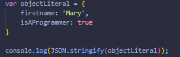

Esto nos permite convertir un objeto en formato JSON

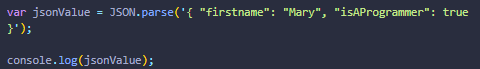

Mientras que este otro ejemplo hace lo contrario, convierte JSON en un
objeto literal

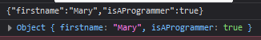

**First Class Functions**: Son funciones almacenadas en una variable,
creadas al vuelo, pasadas como argumento o retornadas por otra función.
Todo lo que puede hacer con otros tipos lo puedes hacer con funciones,
es decir, puedes asignarlas a var, pasarlas, o crearlas sobre la marcha.

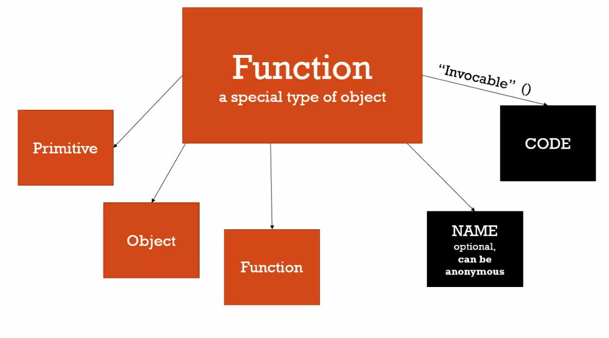

Esto es posible porque para JS las funciones son objetos.

**Function Expression**: Una porción de código que resulta en una
variable, no tiene que guardarse en una variable.

En JS las funciones y las variables hoisteadas de forma distinta, la
función es un objeto especial, por ende es almacenada en su totalidad,
mientras que las variables son declaradas como undefined al momento de
su creación, por eso en la primera ejecución retornamos el console.log y
en la segunda ejecución un error. Porque en la fase de ejecución todavía
no contiene un objeto sino undefined.

**By value**: Cuando se pasa un valor de una variable a otra, copiando
el valor a dos espacios de memoria separados. Usado por valores
primitivos.

**By reference**: Cuando se pasa un valor que apuntan al mismo espacio
de memoria, de esta forma trabajan los objetos (objetos, dunciones,
arrays).

**Mutate**: Cambiar el valor.

**Inmutable**: No puede ser cambiado.

En la línea 29 vemos un caso especial donde by reference no aplica
porque no apunta al mismo espacio de memoria sino a un objeto nuevo
creado al vuelo.

***“Cuando una función se ejecuta un nuevo Execution Context o Contexto
de Ejecución es creado”***

Por alguna razón el this dentro de una función declarativa que está
dentro de un método, apunta al objeto global 🤷... Pero puede
solucionarse, creando una variable cuya referencia sea el this de este
contexto. Ej:

De esta manera estamos completamente seguros que estamos apuntando al
objeto deseado.

**Arguments**: creados cuando el contexto de ejecución de una función es
creado. Alberga los parámetros pasados a dicha función en forma de
array. Por otra parte podemos decir que los argumentos son los
parámetros pasados a una función, sin embargo, javascript tiene la
palabra reservada o keyword con el mismo nombre y como se expresa
anteriormente, los contiene todos.

En la línea 2 se puede ver que se asigna un valor por defecto, y no es
remplazado hasta que nos llega como parámetro en la ejecución de la
línea 21.

Al ser los argumentos interpretados como un array validarlos y tratarlos
de la misma manera para ejecutar nuestro código en concordancia.

Teniendo esto en cuenta podemos usar el spread operator de la misma
forma en que lo haríamos con un array para agregar otros parámetros

**Function Overloading**: No existe en JS, lo que significa que no puede
tener funciones con el mismo nombre y diferentes parámetros porque son
objetos Si se necesita llamar una función con usos distintos, foo(x) y
foo(x,y,z) podemos seguir el siguiente approach:

**Automatic Semicolon Insertion**: Aunque son opcionales, si hay un
retorno de carro o salto de línea (enter) en tu código, el syntax parser
puede insertar un punto y coma. Siempre agrega una llave rizada en la
misma línea para evitar esto. Ej:

**Whitespace**: Caracteres invisibles que crean un "espacio" literal en
su código escrito. Retornos de carro, tabulaciones, espacios.

**Imediately Invoked Function Expressions (IIFEs)**: Expresión de
función que se invoca inmediatamente cuando se crea. La var será el
valor devuelto, no la función. Se utiliza para eliminar cosas del
contexto global.

**Closures**: Donde un contexto de ejecución todavía tiene acceso a
variables / referencias al espacio de memoria en un contexto de
ejecución más grande, incluso si el contexto de ejecución principal ha
salido de la pila. El scope está intacto, dicho de otra forma, sería
cuando una función es capaz de recordar y acceder a un lexical scope,
incluso cuando la función es ejecutada por fuera del lexical scope.

El segundo paréntesis accede a la función anónima dentro de greet, esto
puede hacerse de otra manera, en la ejecución de la variable sayHi,
pasamos el parámetro ‘Tony’, que corresponde de igual forma al contexto
de ejecución de la función anidada en greet.

[Closure info mozilla
dev](https://developer.mozilla.org/en-US/docs/Web/JavaScript/Closures)

**Lexical scope**: Significa que en un grupo anidado de funciones, las
funciones internas tienen acceso a las variables y otros recursos de su
scope principal. Esto significa que las funciones hijas están ligadas
léxicamente al contexto de ejecución de sus padres. El lexical scope a
veces también se denomina scope estático.

Al momento en que se ejecuta fs, se ejecutó el ciclo for, donde se
reescribió el valor de i hasta el momento de en que la expresión era
false, en ese momento i = 3, y en cada contexto de ejecución va a ser
igual, porque apunta a la misma referencia externa y nos devolverá el
valor de i en el momento en que se ejecutó la función, si esperábamos
que el valor de i en cada iteración fuese 0,1 y 2 podemos lograrlo
usando let en lugar de var, creando una nueva referencia externa en cada
iteración.

Otro método alternativo, donde no usamos let sería:

En este caso estamos creando una IIFE que retorna una función que
imprime el valor de i en cada contexto de ejecución.

**Function factories**: Son funciones que retornan funciones,
generalmente haciendo uso de closures.

En este ejemplo, se generan 2 contextos de ejecución, con 2 parámetros
distintos, en cada contexto se almacena language, en y es, apuntando a 2
espacios de memoria distinto y se retornará una función en concordancia
a dichos parámetros, esto sucede cuando las variables greetEnglish y
greetSpanish son igualadas a la ejecución de makeGreetings, después al
ejecutar greetEnglish y greetSpanish con parámetros distintos sucede lo
mismo, creamos 2 contextos de ejecución distintos que apuntan al closure
correspondiente

**Callbacks**: una función que tiene a otra función, que se ejecutará
cuando la otra función haya finalizado.

**call(), apply() y bind() --\> vinculados al objeto this**

**bind()**: crea una copia de una función y le pasa cualquier objeto que
se le quiera vincular a la variable “this”.

Si se intentara ejecutar logName obtendríamos un error, ya que el this
al que hace referencia es el objeto window y getFullName no existe en
ese scope. Al utilizar la función bind con logName y person, el “this”
ahora apunta al objeto person. También puede hacerse al vuelo,
vinculándo person directamente a la función logName:

**call()**: es directamente un llamado o invocacipon a una función y
recibe parámetros para su ejecución.

Al igual que bind() vincula this.getFullname a person pero en este caso
no es una copia de logName, es la ejecución de dicha función pasándole
también los argumentos lang1 y lang2

**apply():** funciona igual que call, la diferencia es que recibe como
segundo parámetro un array de parámetros.

Incluso puede usarse con IIFEs

**Function/Method borrowing**: aplicar métodos de un objeto en otro, sin
necesidad de copiar todo el objeto anterior. Mientras que tengan
propiedades similares.

**Function currying**: Curry es poder llamar una función con menos
parámetros de los que espera, esta devuelve una función que espera los
parámetros restantes y retorna el resultado. Podría decirse que consiste
en transformar una función que utiliza múltiples argumentos en una
secuencia de funciones que utilizan un único argumento.

En este ejemplo, bind crea una copia de multiply y convierte 2 en el
valor por defecto de “a” y luego al invocar multiplyByTwo con cualquier
parámetro, este seconvierte automaticamente en el segundo parámetro o
“b” de la copia de multiply, sería lo mismo que hacer esto:

**Function programming**:

Podemos refactorizar el contenido de ese for en una función que pueda
reutilizarse para iterar con el contenido de arr1 de distintas maneras:

Esta función recibe un array y una función como parámetros, crea un
nuevo array e itera con su contenido con cualquier función que le
pasemos como parámetro.

Puede realizar operaciones matemáticas o comparaciones, de esta forma
creamos código limpio y reutilizable.

Incluso utilizando [currying](https://javascript.info/currying-partials)
se pueden simplificar argumentos

Utilizando librerías --\> [underscorejs](https://underscorejs.org/)

**Inheritance**: Cuando un objeto tiene acceso a propiedades y métodos
de otro objeto.

Prototype: Es un objeto escondido, puede accederse con “.\_\_proto\_\_”

**Classical Inheritance vs Prototypal Inheritance**: La forma más
popular y más antigua, muy detallada. VS. Una forma simple, flexible,
extensible y fácil de entender.

Solo para efectos académicos se usa “\_\_proto\_\_” para acceder al
prototipo de persona desde el objeto “john” y acceder al método
“getFullName”.

Esto solo se puede lograr utilizando funciones tradicionales, ya que el
entorno de “this” en una función de flecha apunta al lexical scope de su
padre, que en este caso sería window.

¿Por qué John y no default? Porque en la cadena de prototipo, firstname
existe dentro del objeto “john”.

Si esa propiedad no existiese en el objeto “john”, al imprimir
“getFullName” obtendríamos “Default Doe” porque buscaría la propiedad
firstname en el objeto vinculado al “\_\_proto\_\_” que sería “person”

[Arrow functions vs Regular
functions](https://levelup.gitconnected.com/arrow-function-vs-regular-function-in-javascript-b6337fb87032)

[Differences between Arrow functions and Regular
functions](https://dmitripavlutin.com/differences-between-arrow-and-regular-functions/)

***¿Cuál es el fin de la cadena de prototipo? --\> El objeto base.***

***¿Cómo acceder a las funciones de JavaScript? --\> Existen en el
prototipo.***

**Reflection**: Un objeto puede mirarse a si mismo, listando y cambiando
sus propiedades y métodos.

**Extend**: a través de reflection, un objeto puede extender o agregar
propiedades y métodos en otros objetos.

**Function contructors**: Una función utilizada para crear un nuevo
objeto vacío. Y este objeto es retornado de la función automáticamente.

**Building objects**:

Creamos una función, con propiedades, a través de new creamos un objeto
vacío y ejecutamos la función Person() para asignarle sus propiedades.
Esto fue hecho para atraer a desarrolladores de otros lenguajes como
Java, creando una sintaxis similar a la que se usa para crear clases en
dicho lenguaje. De esta forma el contexto de “this” cambia con la
ejecución de new Person(), this ahora es el objeto “john”.

De igual forma el objeto Person sigue siendo una función y por eso es
invocable.

Como es de suponer, la variable “jane” apunta al mismo lugar de memoria
de Person, por ende, firstname y lastname nunca van a cambiar, pero
podemos usar una función para crear un objeto donde el valor de sus
propiedades sean parámetros, para que de esta forma cada propiedad tenga
su valor único.

**Function Constructors y prototype**:

Este “prototype” no es el mismo prototipo de todos los objetos al que
podemos acceder a través de dot notation y “\_\_proto\_\_”, este
“prototype” vive dentro de todas las funciones y no se utiliza a menos
que se ejecute esa función para construir un objeto.

La ventaja del uso de prototype es el uso de memoria, ya que al crear
métodos en prototype, no es una copia de dicho método para cada objeto
creado por la ejecución de la función constructor, es el mismo método
como propiedad para todos los objetos creados por Person o Student en el
ejemplo. Si agregáramos un método directamente en el objeto Person,
vamos a tener 1000 copias de dicho método si creáramos mil objetos a
partir de Person en cambio si los creamos en el prototype, ahorramos
espacio asignándole a los 1000 objetos, el mismo método.

**Function Constructors y new:**

IMPORTANTE SOBRE EL USO DE “new”:

Cuando ejecutemos una function constructor nunca olvidemos el new, de lo
contrario se ejecutará como una función tradicional y no creará el
objeto deseado.

Consejo, como convención utiliza letra capitular en function
constructor, eso te ayudará a identificar errores en el caso de que
hayas olvidado agregar el operador “new” y aún mejor a un linter (si
está instalado en tu IDE) a identificar el error.

**Function Constructors Built-in function constructors**:

El valor de “a” como puede verse, no es un primitivo, es un objeto
Number generado por el operador new en conjunto con la función Number,
lo que nos devuelve un objeto con un primitivo. Este objeto number tiene
un prototipo y como tal tiene todas sus propiedades y métodos.

Lo mismo con la función String

En el ejemplo anterior "Tony" es un primitivo pero se le puede aplicar
la propiedad .length porque el motor de JavaScript lo envuelve en un
objeto para poder aplicarle dicho método.

Esto es posible ya que por herencia todos los strings tienen acceso al
método isGreatherThan, además como indicamos en ejemplo anteriores el
string ‘Tony’ es interpretado como un objeto que contiene el primitivo
con el valor antes mencionado.

Sin embargo, lo mismo no es posible trabajando con números directamente,
porque con los strings JavaScript tiene la gentileza de convertirlos en
objetos automáticamente.

Tomando en cuenta lo aprendido, creamos una variable Number que contiene
el primitivo 15 entonces si podemos aplicarle el método isPositive.

String y Number son objetos, ‘Tony’ es interpretado como un objeto pero
15 no es interpretado de esta manera a menos que lo pasemos como valor
del objeto Number.

IMPORTANTE

Esto es posible porque la doble igualdad no evalúa tipo y el valor de
numB es cohersionado a 3 por el operador ==
